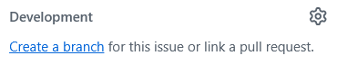

# How to Contribute

Thank you for your interest in contributing to `utd-clubs`! This guide covers our development workflow, coding standards, and more. If you're a bit unsure what you're doing, feel free to ask for help on the [Nebula Labs Discord server](https://discord.utdnebula.com)!

If you need a refresher on how to use Git and/or GitHub, check out [Nebula's Git Workshop](https://github.com/UTDNebula/git-workshop).

## Find something to work on

You can find something cool to work on in these locations:

- [**Issues page**](https://github.com/UTDNebula/utd-clubs/issues) - The first place to look! We put every task here. You could even [create your own issue](https://github.com/UTDNebula/utd-clubs/issues/new/choose).
- [**Project board**](https://github.com/orgs/UTDNebula/projects/33/views/6) - Alternative view of the above page
- [**Recommended for Recruits**](https://github.com/UTDNebula/utd-clubs/issues/views/MDI0OlJlcG9zaXRvcnlTZWFyY2hTaG9ydGN1dDE2MTQ1) - Are you new? Find something easy to work on here!

Once you find an issue, claim it by adding a comment to it asking to work on it (or feel free to assign it to yourself). You can either work independently or collaborate on an issue.

**If an issue is confusing, let us know!** Ask a question on the issue's GitHub page, or send a message on our Discord, or ask in person during meetings.

## Create a branch

Nebula recruits and members should make their changes on a branch in the `utd-clubs` repository. External contributors should work off of a fork, as they do not have permission to make a branch.

When creating a branch, please follow our naming convention:

```bash
<issue-number>-<short-description-of-issue>
```

For example, `123-new-feature-name` is acceptable.

> [!TIP]
>
> GitHub can automatically create a branch for you that follows this naming convention. On the page for your issue, select "Create a branch" under the Development section in the right sidebar:
>
> 

## Make Your Changes

It's time to code!

Don't forget to format and check your code periodically:

```bash
npm run format && npm run lint && npm run type:check
```

Discuss your progress frequently, and push your commits to GitHub. You can use [GitHub Desktop](https://github.com/apps/desktop) to make this easier. Avoid using AI to write code for your first contribution.

If you ever get stuck, feel free to ask. You can also create a draft pull request (see below) so we can see your progress and help out!

## Making a Pull Request (PR)

Once you've pushed your branch to GitHub, open the [pull request page](https://github.com/UTDNebula/utd-clubs/pulls) and create a PR.

> [!TIP]
> To create a pull request...
>
> 1. Click the "New pull request" button at the top right, which will open the compare page.
> 2. Select your branch from the list (under the "compare" dropdown), then click the green "Create pull request" button
> 3. Fill out the description, then press "Create pull request" one last time
>    - If you're not finished with your changes, select "Create draft pull request" under the dropdown.

Then, maintainers will review your PR and may provide suggestions before approving it. Don't take suggestions personally, we're just looking to help!

When your pull request is approved, it will be "merged," meaning your feature will instantly be visible on the [development version of UTD Clubs](https://dev.clubs.utdnebula.com). Whenever your project lead publishes a [release](https://github.com/UTDNebula/utd-clubs/releases), your feature will then be visible on the main website.

In the meantime, you can find another issue to work on!
